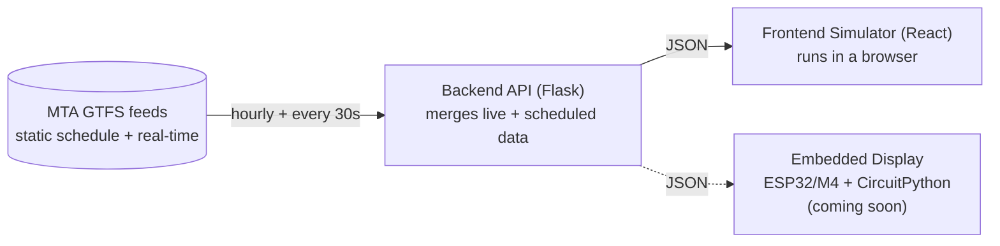

# TransitTicker

A live NYC subway departure API, purpose-built to eventually drive a small
physical countdown display. Give it a route, a station, and a direction -
it returns the next few departures, blending MTA's real-time predictions
with the static schedule as a fallback.

[](Backend)
[](Backend/src/app.py)
[](Frontend/static/index.html)
[](docker-compose.yml)
[](infra)
[](#roadmap)

## What this is

MTA publishes two kinds of transit data: a static schedule (the full day's
timetable, refreshed roughly hourly) and GTFS-Realtime feeds (live per-trip
predictions, updated roughly every 30 seconds, but only for trips actively
being tracked). This project fetches and merges both, and exposes a small
API meant for a device with a handful of display lines, not a full trip
planner: three endpoints, a route/station/direction as input, a short list
of upcoming departures as output.

A browser-based simulator (`Frontend/`) stands in for the physical display
this is ultimately meant to drive - see [Roadmap](#roadmap).

## Architecture



## Repository structure

```
TransitTicker/
├── Backend/                  Flask API: fetches, merges, and serves transit data
│   ├── src/
│   │   ├── app.py            Routes, request handling, background refresh scheduler
│   │   ├── refresh.py        Downloads and parses the static GTFS schedule (hourly)
│   │   ├── realtime.py       Fetches and parses live GTFS-Realtime feeds (every 30s)
│   │   └── getters.py        Query logic: routes, stations, next departures
│   └── Dockerfile
│
├── Frontend/                 Browser-based simulator of the eventual embedded display
│   ├── static/index.html     React UI - no build step, CDN scripts + in-browser JSX
│   ├── server.py             Minimal Flask server that serves the static page
│   └── Dockerfile
│
├── infra/                    Terraform: VPC, ALB, ECS Fargate, ECR, IAM (see infra/README.md)
│   └── bootstrap/            One-time AWS trust setup for CI (see infra/bootstrap/README.md)
│
├── .github/workflows/        CI/CD: build + deploy app images, plan + apply infrastructure
├── docker-compose.yml        Runs Backend + Frontend together for local development
└── CLAUDE.md                 Project conventions Claude Code follows in this repo
```

## Getting started

Requires Docker Desktop. From the repository root:

```
docker compose up --build
```

- Frontend simulator: [http://localhost:5001](http://localhost:5001)
- Backend API directly: [http://localhost:5000](http://localhost:5000)

The backend downloads and parses MTA's static GTFS feed on startup, which
can take a little while the first time - watch the logs for `Loaded '...'
data into memory` lines to see it progressing.

## API reference

| Endpoint | Description |
|---|---|
| `GET /` | Next departures for a route/stop/direction. Query params: `route`, `stop`, `direction` (`0` = uptown, `1` = downtown), `count` (1-10, default 3). |
| `GET /routes` | Every known route ID, for populating a route selector. |
| `GET /routes/<route_id>/stops` | Every station served by that route, one entry per physical station (not per directional platform). |

Example:

```
curl "http://localhost:5000/?route=Q&stop=Q05&direction=1&count=3"
```

```json
{
  "departures": [
    { "departure_time": "14:32:00", "minutes_away": 4, "is_realtime": true },
    { "departure_time": "14:41:00", "minutes_away": 13, "is_realtime": true },
    { "departure_time": "14:58:00", "minutes_away": 30, "is_realtime": false }
  ]
}
```

`is_realtime` distinguishes a live-tracked prediction from a static
schedule fallback - MTA only tracks trips actively en route, so it's normal
for the soonest departure or two to be `true` and later ones to be `false`.

## Deployment

The backend and frontend deploy to AWS ECS Fargate behind a shared
Application Load Balancer, provisioned with Terraform and run entirely
through GitHub Actions (no local Terraform/AWS CLI required after a small
one-time trust setup). Full details, cost estimates, and setup steps live in
[infra/README.md](infra/README.md).

## Roadmap

### Coming soon: embedded hardware

The API in this repo is being built for a physical device, not just the
browser simulator: an LED matrix departure board running on an Adafruit
ESP32/M4-family microcontroller, with CircuitPython firmware polling this
backend for the next few departures at a fixed route/stop/direction and
rendering them on the matrix. That firmware doesn't exist yet - everything
in this repository today covers the API and the software simulator that
stands in for the hardware in the meantime.

### Other known gaps

- No authentication or rate limiting on the API - fine for a personal
  project behind its current setup, worth revisiting before wider exposure.
- No custom domain or HTTPS on the AWS deployment yet (see
  [infra/README.md](infra/README.md#known-gaps)).
- No automated tests.
