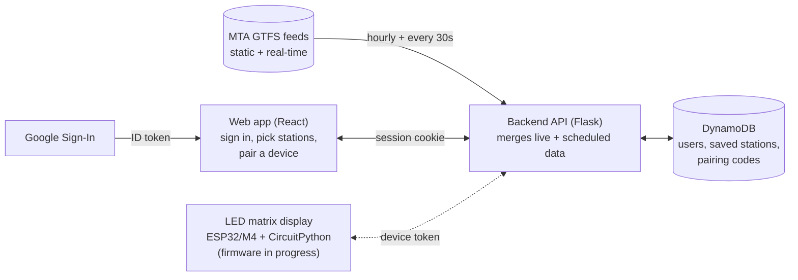

# TransitTicker

A live NYC subway departure board, built to drive a small physical
countdown display. Sign in, pick up to three stations, and TransitTicker
serves the next few departures for each one - blending MTA's real-time
predictions with the static schedule as a fallback - to a paired device
or to the browser-based simulator.

[](Backend)
[](Backend/src/app.py)
[](Frontend/static/index.html)
[](infra/dynamodb.tf)
[](docker-compose.yml)
[](infra)
[](#roadmap)

## What this is

MTA publishes two kinds of transit data: a static schedule (the full day's
timetable) and GTFS-Realtime feeds (live per-trip predictions, updated
about every 30 seconds, but only for trips actively being tracked). The
backend fetches and merges both, keeping everything in memory.

On top of that sits a small account system:

- **Users sign in with Google** and save up to three stations (route, stop,
  and direction each) to their account.
- **A physical display pairs with an account** using a short code shown on
  its own screen - no per-device setup, flashing, or typing credentials
  into hardware.
- **The paired device asks for its departures with a single token** and
  gets back a board for each saved station.

The web frontend is where users sign in, choose stations, and pair a
device. It also previews each saved station's live departures, so it
doubles as a simulator for what the hardware will show.

## Architecture


```mermaid
flowchart LR
    MTA[("MTA GTFS feeds<br/>static + real-time")]
    Google["Google Sign-In"]
    Backend["Backend API (Flask)<br/>merges live + scheduled data"]
    DB[("DynamoDB<br/>users, saved stations,<br/>pairing codes")]
    Frontend["Web app (React)<br/>sign in, pick stations,<br/>pair a device"]
    Embedded["LED matrix display<br/>ESP32/M4 + CircuitPython<br/>(firmware in progress)"]

    MTA -->|hourly + every 30s| Backend
    Backend <--> DB
    Google -->|ID token| Frontend
    Frontend <-->|session cookie| Backend
    Embedded <-.->|device token| Backend
```

## How it works

**In the browser**

1. Sign in with Google. Nothing else on the page loads until you do.
2. Pick a route, stop, and direction for up to three stations, shown side
   by side.
3. Save. The selection is written to your account, and each station shows
   its next three departures, refreshing every 30 seconds.

**On a device**

1. A device with no stored token calls `POST /device/pair/start` and shows
   the six-character code it gets back.
2. You type that code into the web app's Device field. The code expires
   after 10 minutes and works once.
3. The device polls `GET /device/pair/status/<code>`, receives its
   permanent token once you've claimed it, and stores it locally.
4. From then on it polls `GET /device/<token>` for its boards. A `401`
   means the device was unlinked, so it starts pairing again.

The raw device token never appears in the browser: it passes only between
the backend and the device. Unlinking clears the token but keeps your
saved stations, so a replacement device picks them straight back up.

## Repository structure

```
TransitTicker/
├── Backend/                  Flask API
│   ├── src/
│   │   ├── app.py            Routes, CORS, startup, background refresh scheduler
│   │   ├── refresh.py        Downloads and parses the static GTFS schedule (hourly)
│   │   ├── realtime.py       Fetches and parses GTFS-Realtime feeds (every 30s)
│   │   ├── getters.py        Query logic: routes, stations, next departures
│   │   ├── auth.py           Google ID token verification, login_required
│   │   ├── users.py          DynamoDB access: accounts, saved stations, device tokens
│   │   └── pairing.py        DynamoDB access: short-lived device pairing codes
│   └── Dockerfile
│
├── Frontend/                 Web app
│   ├── static/index.html     React UI - no build step, CDN scripts + in-browser JSX
│   ├── server.py             Flask server for the page plus a runtime /config.js
│   └── Dockerfile
│
├── infra/                    Terraform: VPC, ALB, ECS Fargate, ECR, DynamoDB, IAM
│   └── bootstrap/            One-time AWS trust setup for CI (see infra/bootstrap/README.md)
│
├── .github/workflows/        CI/CD: build + deploy images, plan + apply infrastructure
├── docker-compose.yml        Backend, frontend, and DynamoDB Local for development
├── .env.example              Local settings template (Google Client ID)
└── CLAUDE.md                 Project conventions Claude Code follows in this repo
```

## Getting started

### Prerequisites

- Docker Desktop.
- A Google OAuth client ID. In [Google Cloud Console](https://console.cloud.google.com),
  go to APIs & Services → Credentials → Create Credentials → OAuth client
  ID → **Web application**. Under Authorized JavaScript origins add both
  of these:
  ```
  http://localhost:5001
  http://127.0.0.1:5001
  ```
  Google matches origins exactly, so `localhost` and `127.0.0.1` count as
  different sites. Docker Desktop's own links often open `127.0.0.1`.

### Run it

```
cp .env.example .env
# edit .env and set GOOGLE_CLIENT_ID to your client ID
docker compose up --build
```

- Web app: [http://localhost:5001](http://localhost:5001)
- Backend API: [http://localhost:5000](http://localhost:5000)

The first startup downloads and parses MTA's static schedule, which takes a
little while. Watch the backend logs for `Loaded '...' data into memory`.

Local data lives in DynamoDB Local in memory, so accounts, saved stations,
and pairings reset every time the containers restart.

### Troubleshooting

| Symptom | Cause |
|---|---|
| Google shows `Error 400: origin_mismatch` | The address in your browser bar isn't registered as an Authorized JavaScript origin. Register both origins listed above. |
| `Sign-in failed: NetworkError...` | Often a browser ad blocker blocking Google's sign-in script or the backend request. Try with extensions disabled. |
| `Bind for 0.0.0.0:8000 failed: port is already allocated` | A leftover container from an earlier run. Run `docker compose down`, or `docker rm -f transitticker-dynamodb-local-1`. |
| A request fails with `temporarily unable to reach the database` | The backend can't reach DynamoDB Local. Restart with `docker compose down` then `docker compose up --build`. |

## API reference

**Public** - no authentication.

| Endpoint | Description |
|---|---|
| `GET /` | Next departures for one station. Query params: `route`, `stop`, `direction` (`0` uptown, `1` downtown), `count` (1-10, default 3). |
| `GET /routes` | Every known route ID. |
| `GET /routes/<route_id>/stops` | Every station on that route, one entry per physical station. |

**Account** - require the session cookie set by `/auth/google`.

| Endpoint | Description |
|---|---|
| `POST /auth/google` | Body `{"id_token": ...}` from Google Sign-In. Creates the account on first login and starts a session. |
| `GET /auth/me` | The signed-in user: `user_id`, `device_paired`, `preferences`. |
| `POST /auth/logout` | Ends the session. |
| `GET /preferences` | The signed-in user's saved stations. |
| `POST /preferences` | Body `{"preferences": [...]}`, up to 3 of `{route, stop, direction}`. Replaces the saved list. |
| `POST /device/pair/claim` | Body `{"pairing_code": ...}`. Binds the device showing that code to this account. |
| `POST /device/unlink` | Revokes the paired device's token. Saved stations are kept. |

**Device** - called by the display itself.

| Endpoint | Description |
|---|---|
| `POST /device/pair/start` | Returns `{"pairing_code", "expires_in"}` for the device to display. |
| `GET /device/pair/status/<code>` | `pending`, `claimed` (with `device_token`), or `not_found` (unknown or expired). |
| `GET /device/<device_token>` | Departure boards for every saved station. `401` if the token is unknown or unlinked. |

Example:

```
curl "http://localhost:5000/?route=Q&stop=Q05&direction=1&count=3"
```

```json
{
  "departures": [
    { "departure_time": "14:32:00", "minutes_away": 4, "is_realtime": true },
    { "departure_time": "14:41:00", "minutes_away": 13, "is_realtime": true },
    { "departure_time": "14:58:00", "minutes_away": 30, "is_realtime": false }
  ]
}
```

`GET /device/<device_token>` returns one of these per saved station:
`{"boards": [{"departures": [...]}, ...]}`.

`is_realtime` marks a live-tracked prediction, as opposed to a static
schedule time. MTA only tracks trips actively en route, so the soonest one
or two departures are usually `true` and later ones `false`.

## Deployment

The backend and frontend deploy to AWS ECS Fargate behind a shared
Application Load Balancer, with DynamoDB for accounts and pairing codes.
Infrastructure is defined in Terraform and applied through GitHub Actions,
after a one-time trust setup. The workflows need a `GOOGLE_CLIENT_ID`
repository variable, and the ALB's URL must be added as another Authorized
JavaScript origin. Full setup steps, costs, and known gaps are in
[infra/README.md](infra/README.md).

## Roadmap

### Embedded hardware

The target device is an LED matrix departure board on an Adafruit
ESP32/M4-family microcontroller running CircuitPython. The backend side is
ready for it: pairing, the device token lifecycle, and the
`GET /device/<device_token>` endpoint all exist. The firmware itself is
still in progress.

### Known gaps

- No automated tests.
- No rate limiting on the public and device endpoints.
- No custom domain or HTTPS on the AWS deployment (see
  [infra/README.md](infra/README.md#known-gaps)).
- The backend image runs Python 3.9, which is past end of life;
  `google-auth` prints a warning about it at startup.
